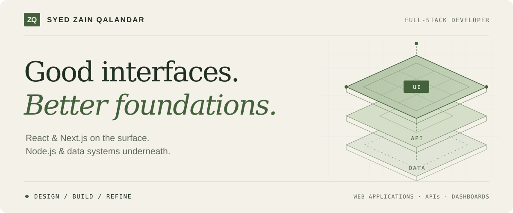
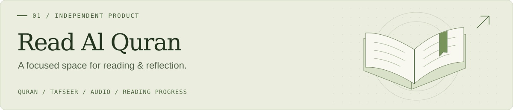
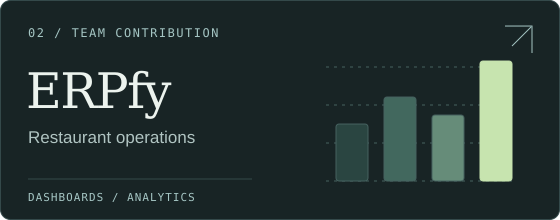
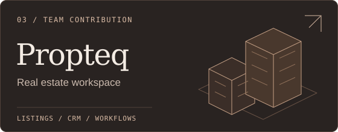

<picture>
  <source media="(prefers-color-scheme: dark) and (max-width: 600px)" srcset="./assets/hero-dark-mobile.svg" />
  <source media="(max-width: 600px)" srcset="./assets/hero-light-mobile.svg" />
  <source media="(prefers-color-scheme: dark)" srcset="./assets/hero-dark.svg" />
  <source media="(prefers-color-scheme: light)" srcset="./assets/hero-light.svg" />
  
</picture>

 

I’m **Syed Zain Qalandar**. I build web applications from the interface down to the API, with a focus on clear interactions, maintainable code, and the details that make a product feel finished.

**[Explore my portfolio ↗](https://www.zainqalandar.online/)** &nbsp; / &nbsp; [LinkedIn](https://www.linkedin.com/in/zainqalandar-online/) &nbsp; / &nbsp; [Email me](mailto:zainqlandar@gmail.com)

 

## Selected work

An independent product, alongside platforms I’ve helped build.

### [Read Al Quran ↗](https://readalquran.online/)

A Quran reading platform bringing together all 114 Surahs, translations, Tafseer, and audio recitations. Bookmarks, favourites, and saved progress help readers pick up where they left off.

**Built across the stack:** the reading experience, a management and analytics dashboard, search metadata, and PWA support.

`Next.js` `React` `TypeScript` `MongoDB` `Redux Toolkit`

 

<table>
  <tr>
    <td width="50%" valign="top">
      
      <h3><a href="https://admin.erpfy.app/sign-in">ERPfy ↗</a></h3>
      
Restaurant operations, from sales and reservations to inventory and staff.

      
<strong>My contribution:</strong> KPI dashboards, reporting, location and date filters, and responsive interfaces.

      
<code>Next.js</code> <code>TypeScript</code> <code>Redux Toolkit</code>

      
Team contribution · Product sign-in

    </td>
    <td width="50%" valign="top">
      
      <h3><a href="https://app.propteq.ai/auth/sign-in">Propteq ↗</a></h3>
      
A real estate workspace for property listings, leads, contacts, and agency operations.

      
<strong>My contribution:</strong> reusable listing views, search and filters, agent assignment, and API integration.

      
<code>Next.js</code> <code>TypeScript</code>

      
Team contribution · Product sign-in

    </td>
  </tr>
</table>

 

## Behind the build

**Interface** &nbsp; / &nbsp; React · Next.js · TypeScript · Tailwind CSS 
Responsive layouts, reusable components, and deliberate loading states.

**Application** &nbsp; / &nbsp; Node.js · Express · REST APIs 
Authentication, role-based access, and clear API boundaries.

**Data** &nbsp; / &nbsp; MongoDB · Mongoose · PostgreSQL 
Data modelling, validation, and dependable application flows.

**Delivery** &nbsp; / &nbsp; Git · Docker · Vercel · Render 
Maintainable releases, rendering performance, and search visibility.

 

## On my workbench

Deepening my work in **backend architecture and system design**, and building full-stack products where the interface and the underlying systems get equal attention.

---

**Have something worth building?** I’m open to product collaborations and frontend or full-stack work.

[Start a conversation ↗](mailto:zainqlandar@gmail.com) &nbsp; / &nbsp; [Browse my repositories](https://github.com/Zainqalandar?tab=repositories) &nbsp; / &nbsp; [Visit my portfolio](https://www.zainqalandar.online/)
